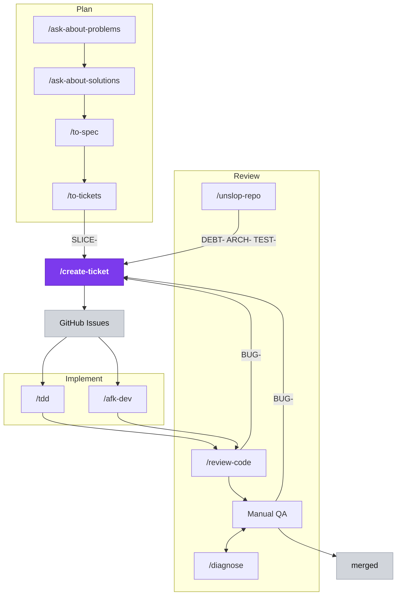

# agent-skills

Personal **skills** and **rules** for Cursor and Claude Code. One `skills/` folder, identical `SKILL.md` format, symlinked on each machine. Syncs via OneDrive; version history on GitHub.

Inspired and adopted from [mattpocock/skills](https://github.com/mattpocock/skills)

## Layout

```
agent-skills/
├── README.md
├── LICENSE                       ← MIT
├── .github/workflows/            ← CI: validates skills against the anatomy on push/PR
├── docs/
│   ├── skill-anatomy.md          ← the SKILL.md contract every skill follows
│   └── SKILL-template.md         ← starter for new skills
├── scripts/validate-skills.js    ← structure validator (run locally or in CI)
├── rules/                        ← Cursor rules (loaded via ~/.cursor/rules symlink; Cursor only)
└── skills/
    ├── product/                  ← product workflow chain (public)
    ├── vault/                    ← knowledge/Obsidian tools (public)
    ├── utilities/                ← session + dev utilities (public)
    └── private/                  ← private skills (.git/info/exclude, never pushed)
```

## Setup (once per machine)

Claude and Cursor read skills from a flat `~/.claude/skills/` and `~/.cursor/skills/`, so each skill is symlinked individually out of the grouped `skills/<group>/<name>/` layout. There's no setup script — wire it once, or just **ask Claude to do it for you**.

**macOS / Linux** — from the repo root:

```bash
mkdir -p ~/.claude/skills ~/.cursor/skills
for d in skills/*/*/; do
  ln -sfn "$PWD/$d" ~/.claude/skills/"$(basename "$d")"
  ln -sfn "$PWD/$d" ~/.cursor/skills/"$(basename "$d")"
done
ln -sfn "$PWD/rules" ~/.cursor/rules   # Cursor rules (Cursor only)
```

**Windows:** ask Claude to create the equivalent links, or use `New-Item -ItemType SymbolicLink`.

Restart Cursor / Claude after wiring.

Private skills live under `skills/private/` but are listed in `.git/info/exclude` — they sync on your devices but never reach GitHub.

---

## Product workflow (any repo)

Three stages — **Plan → Implement → Review** — around **`/create-ticket`**, the hub every ticket flows through (the only skill that runs `gh issue create`). **Plan** files new work as `SLICE-`; **Review** files `DEBT-`/`ARCH-`/`TEST-` (from `/unslop-repo`) and `BUG-` (from `/review-code` and Manual QA). Manual QA ⇄ `/diagnose` is the iterative debug loop; passing QA ships to `merged`. Run **`/init-docs`** once to scaffold `docs/`, then:



**Two entry points**, decided by one question — *was this capability ever built?* The *feature lane* (never built) plans through the interview → spec → tickets chain; the *maintenance lane* (shipped behavior — a QA/`/diagnose` bug or an `/unslop-repo` refactor) files straight to `/create-ticket`.

The docs the user reads are **`docs/foundation/OVERVIEW.md`** (problem → system idea & key components → key user workflows → decisions) and **`docs/foundation/DICTIONARY.md`** (canonical terms). Specs and tickets are GitHub issues, never repo files.

| Lane | Trigger | Skills |
|------|---------|--------|
| **Feature** | New capability, never built | `/ask-about-problems` → `/ask-about-solutions` → `/to-spec` → `/to-tickets` → `/create-ticket` |
| **Maintenance** | Shipped behavior broken / regressed | `/diagnose` or a QA finding → `/create-ticket` (`BUG-`) |
| **Architecture** | Periodic hygiene | `/unslop-repo` → `/create-ticket` (`DEBT-`/`ARCH-`/`TEST-`) |
| **Build** | Any filed issue | `/tdd` (one) or `/afk-dev` (batch `agent:hitl`) → `/review-code` → merge |

| Step | Skill | Output |
|------|-------|--------|
| 1 | `/ask-about-problems` | `docs/foundation/OVERVIEW.md` → Problem section |
| 2 | `/ask-about-solutions` | OVERVIEW.md solution sections + **`docs/foundation/DICTIONARY.md`** (+ sparing ADRs) |
| 3 | `/to-spec` | Spec issue on GitHub (label `spec`) — agent-facing, not reviewed by you |
| 4 | `/to-tickets` | SLICE tickets, blocked-by wired, filed via `/create-ticket` |
| 5 | `/tdd` / `/afk-dev` | Code + tests → PR |
| 6 | `/review-code` | Two-axis review (standards + spec fidelity) before merge |
| — | `/diagnose` | Bugs — feedback loop first, regression test |
| — | `/unslop-repo` | Architecture hygiene (periodic) → `/create-ticket` |

`/create-ticket` is the **only** skill that runs `gh issue create` — both lanes converge on it. Filing rules: [create-ticket/CONVENTIONS.md](skills/product/create-ticket/CONVENTIONS.md)

---

## Skill index

### product/

| Skill | Role |
|-------|------|
| [init-docs](skills/product/init-docs/SKILL.md) | Scaffold the `docs/` layout (OVERVIEW + DICTIONARY + two-lane README) |
| [ask-about-problems](skills/product/ask-about-problems/SKILL.md) | (feature 1) Mom Test problem interview → OVERVIEW.md Problem |
| [ask-about-solutions](skills/product/ask-about-solutions/SKILL.md) | (feature 2) Solution stress-test → OVERVIEW.md + `DICTIONARY.md` |
| [to-spec](skills/product/to-spec/SKILL.md) | (feature 3) Synthesize the spec → GitHub issue (`spec`) |
| [to-tickets](skills/product/to-tickets/SKILL.md) | (feature 4) Slice the spec into vertical-slice tickets |
| [create-ticket](skills/product/create-ticket/SKILL.md) | Canonical issue filing — sole `gh` gateway ([CONVENTIONS.md](skills/product/create-ticket/CONVENTIONS.md)) |
| [tdd](skills/product/tdd/SKILL.md) | Red-green-refactor from an issue or bug |
| [review-code](skills/product/review-code/SKILL.md) | Two-axis PR review (standards + spec fidelity) after `/tdd` or `/afk-dev` |
| [afk-dev](skills/product/afk-dev/SKILL.md) | Triage `agent:*` issues → spawn worker agents → manual QA ([CONVENTIONS.md](skills/product/afk-dev/CONVENTIONS.md)) |
| [diagnose](skills/product/diagnose/SKILL.md) | Disciplined debug loop |
| [unslop-repo](skills/product/unslop-repo/SKILL.md) | Shallow → deep module reviews; files candidates via `/create-ticket` |

### vault/

| Skill | Role |
|-------|------|
| [contemplate](skills/vault/contemplate/SKILL.md) | Ingest Obsidian `sources/` → wiki |
| [remember](skills/vault/remember/SKILL.md) | Save content to vault sources |
| [get-yt-transcript](skills/vault/get-yt-transcript/SKILL.md) | YouTube transcript download |

### utilities/

| Skill | Role |
|-------|------|
| [handoff](skills/utilities/handoff/SKILL.md) | Hand off to the next agent — **Quick** (paste block) or **Full** (temp doc + pointer) |
| [caveman](skills/utilities/caveman/SKILL.md) | Ultra-compressed replies |
| [make-secure](skills/utilities/make-secure/SKILL.md) | Audit skills for security risks |

---

## Adding a skill

1. Copy [`docs/SKILL-template.md`](docs/SKILL-template.md) → `skills/<group>/<name>/SKILL.md`, following the contract in [`docs/skill-anatomy.md`](docs/skill-anatomy.md)
   - `<group>` = `product`, `vault`, `utilities`, or `private`
2. Fill frontmatter + instructions (`name` must match the directory)
3. Symlink it into `~/.claude/skills/` (and `~/.cursor/skills/`) — see [Setup](#setup-once-per-machine), or just ask Claude to wire it
4. Run `node scripts/validate-skills.js` until it passes
5. Add a row to the index above (omit private skills)
6. For private skills: place under `skills/private/` — already covered by `.git/info/exclude`

