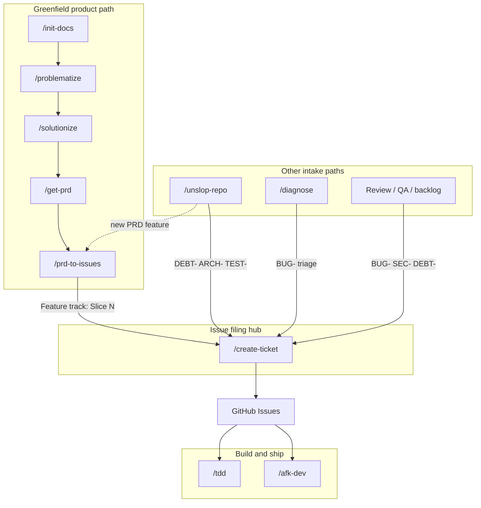

# agent-skills

Personal **skills** and **rules** for Cursor and Claude Code. One `skills/` folder, identical `SKILL.md` format, symlinked on each machine. Syncs via OneDrive; version history on GitHub.

Inspired and adopted from [mattpocock/skills](https://github.com/mattpocock/skills)

## Layout

```
agent-skills/
├── README.md
├── LICENSE                       ← MIT
├── .claude/CLAUDE.md             ← security rules for skill development (no PII, private-skill checklist)
├── .github/workflows/            ← CI: validates skills against the anatomy on push/PR
├── docs/
│   ├── skill-anatomy.md          ← the SKILL.md contract every skill follows
│   └── SKILL-template.md         ← starter for new skills
├── scripts/validate-skills.js    ← structure validator (run locally or in CI)
├── rules/                        ← Cursor rules (loaded via ~/.cursor/rules symlink; Cursor only)
└── skills/
    ├── product/                  ← product workflow chain (public)
    ├── vault/                    ← knowledge/Obsidian tools (public)
    ├── utilities/                ← session + dev utilities (public)
    └── private/                  ← private skills (.git/info/exclude, never pushed)
```

## Setup (once per machine)

Claude and Cursor read skills from a flat `~/.claude/skills/` and `~/.cursor/skills/`, so each skill is symlinked individually out of the grouped `skills/<group>/<name>/` layout. There's no setup script — wire it once, or just **ask Claude to do it for you**.

**macOS / Linux** — from the repo root:

```bash
mkdir -p ~/.claude/skills ~/.cursor/skills
for d in skills/*/*/; do
  ln -sfn "$PWD/$d" ~/.claude/skills/"$(basename "$d")"
  ln -sfn "$PWD/$d" ~/.cursor/skills/"$(basename "$d")"
done
ln -sfn "$PWD/rules" ~/.cursor/rules   # Cursor rules (Cursor only)
```

**Windows:** ask Claude to create the equivalent links, or use `New-Item -ItemType SymbolicLink`.

Restart Cursor / Claude after wiring.

Private skills live under `skills/private/` but are listed in `.git/info/exclude` — they sync on your devices but never reach GitHub.

---

## Product workflow (any repo)

Run **`/init-docs`** once to scaffold `docs/`. Then:



**Reading the diagram**

| Path | Skills | Issue style |
|------|--------|-------------|
| New product | `/init-docs` → … → `/prd-to-issues` → `/create-ticket` | Feature track (`Slice N — …`) |
| Architecture review | `/unslop-repo` → `/create-ticket` | Review track (`DEBT-`, `ARCH-`, `TEST-`) |
| Bugs | `/diagnose` → `/create-ticket` (optional) | `BUG-` + triage body |
| Review / QA | `/create-ticket` | `BUG-`, `SEC-`, `DEBT-`, … |
| Execute | `/tdd` (one issue) or `/afk-dev` (batch `agent:hitl`) | — |

Filing rules: [create-ticket/CONVENTIONS.md](skills/product/create-ticket/CONVENTIONS.md)

| Step | Skill | Output |
|------|-------|--------|
| 1 | `/problematize` | `docs/problem_summary.md` (+ raw terms) |
| 2 | `/solutionize` | `docs/solution_overview.md` + **`docs/CONTEXT.md`** |
| 3 | `/get-prd` | `docs/prd.md` (Glossary from CONTEXT) |
| 4 | `/prd-to-issues` | GitHub issues (vertical slices) — filing via `/create-ticket` |
| 4b | `/create-ticket` | Canonical issue filing (prefixes, labels, HITL/AFK) — review backlog, QA, triage, **unslop candidates** |
| 5 | `/tdd` | Code + tests |
| 6 | `/afk-dev` | Coordinated multi-agent cycle on `agent:hitl` issues — plan, spawn worker agents on branches, summary + manual QA |
| — | `/diagnose` | Bugs — feedback loop first, regression test |
| — | `/unslop-repo` | Architecture hygiene (periodic) |

After shipping, run **`/unslop-repo`** when entropy builds up. It reads CONTEXT + PRD, proposes deepenings, may write `docs/modules/` and ADRs, then files approved candidates via **`/create-ticket`** (`DEBT-`/`ARCH-`/…) → **`/tdd`** or **`/afk-dev`**. New PRD-scope features go through **`/prd-to-issues`** instead.

---

## Skill index

### product/

| Skill | Role |
|-------|------|
| [init-docs](skills/product/init-docs/SKILL.md) | Scaffold the `docs/` layout |
| [problematize](skills/product/problematize/SKILL.md) | (1/4) Mom Test problem investigation |
| [solutionize](skills/product/solutionize/SKILL.md) | (2/4) Solution stress-test → `CONTEXT.md` (update-safe) |
| [get-prd](skills/product/get-prd/SKILL.md) | (3/4) Synthesize `docs/prd.md` |
| [prd-to-issues](skills/product/prd-to-issues/SKILL.md) | (4/4) Vertical-slice GitHub issues |
| [create-ticket](skills/product/create-ticket/SKILL.md) | Canonical issue filing — prefixes, labels, HITL/AFK ([CONVENTIONS.md](skills/product/create-ticket/CONVENTIONS.md)) |
| [tdd](skills/product/tdd/SKILL.md) | Red-green-refactor from an issue or bug |
| [afk-dev](skills/product/afk-dev/SKILL.md) | Triage `agent:*` issues → spawn worker agents → manual QA ([CONVENTIONS.md](skills/product/afk-dev/CONVENTIONS.md)) |
| [diagnose](skills/product/diagnose/SKILL.md) | Disciplined debug loop |
| [unslop-repo](skills/product/unslop-repo/SKILL.md) | Shallow → deep module reviews; files candidates via `/create-ticket` |

### vault/

| Skill | Role |
|-------|------|
| [contemplate](skills/vault/contemplate/SKILL.md) | Ingest Obsidian `sources/` → wiki |
| [remember](skills/vault/remember/SKILL.md) | Save content to vault sources |
| [get-yt-transcript](skills/vault/get-yt-transcript/SKILL.md) | YouTube transcript download |

### utilities/

| Skill | Role |
|-------|------|
| [handoff](skills/utilities/handoff/SKILL.md) | Hand off to the next agent — **Quick** (paste block) or **Full** (temp doc + pointer) |
| [caveman](skills/utilities/caveman/SKILL.md) | Ultra-compressed replies |
| [make-secure](skills/utilities/make-secure/SKILL.md) | Audit skills for security risks |

---

## Adding a skill

1. Copy [`docs/SKILL-template.md`](docs/SKILL-template.md) → `skills/<group>/<name>/SKILL.md`, following the contract in [`docs/skill-anatomy.md`](docs/skill-anatomy.md)
   - `<group>` = `product`, `vault`, `utilities`, or `private`
2. Fill frontmatter + instructions (`name` must match the directory)
3. Symlink it into `~/.claude/skills/` (and `~/.cursor/skills/`) — see [Setup](#setup-once-per-machine), or just ask Claude to wire it
4. Run `node scripts/validate-skills.js` until it passes
5. Add a row to the index above (omit private skills)
6. For private skills: place under `skills/private/` — already covered by `.git/info/exclude`

