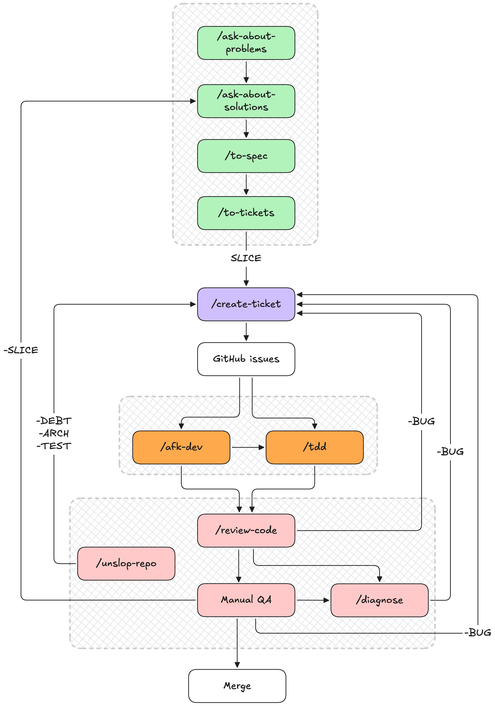

# agent-skills

Personal **skills** and **rules** for Cursor and Claude Code. One `skills/` folder, one `SKILL.md` format, symlinked into `~/.claude/skills/` and `~/.cursor/skills/` on each machine. Versioned on GitHub.

**What's inside** — four kinds of skills:

| Group | Purpose |
|-------|---------|
| **product/** | The end-to-end development workflow — plan → implement → review → merge |
| **vault/** | Knowledge tools — ingest sources into an Obsidian vault |
| **utilities/** | Session helpers — handoff, compression, security audits |
| **private/** | Personal skills, never pushed (listed in `.git/info/exclude`) |

Inspired by and adapted from [mattpocock/skills](https://github.com/mattpocock/skills).

### Layout

```
agent-skills/
├── README.md
├── LICENSE               ← MIT
├── .github/workflows/    ← CI: skill validation
├── docs/
│   ├── skill-anatomy.md  ← the SKILL.md contract
│   ├── SKILL-template.md ← new-skill starter
│   └── assets/           ← workflow diagram
├── scripts/              ← structure validator
├── rules/                ← Cursor rules
└── skills/
    ├── product/          ← the development workflow
    ├── vault/            ← knowledge / Obsidian tools
    ├── utilities/        ← session + dev helpers
    └── private/          ← never pushed (excluded)
```

---

## product/ — the development workflow

The core of this repo: a chain that carries a repo from **an empty folder to continuous development**. Run **`/init-docs`** once to scaffold `docs/`, then every change funnels through **`/create-ticket`** — the *only* skill that runs `gh issue create` — and out to a merge. Bugs and hygiene loop straight back to it, so the same flow that ships the first feature also runs forever after.



> Editable source: [`docs/assets/dev-workflow.excalidraw`](docs/assets/dev-workflow.excalidraw) — open at [excalidraw.com](https://excalidraw.com).

**Two entry points**, chosen by one question — *was this capability ever built?*

1. **Feature lane** (never built) — interview → spec → tickets: `/ask-about-problems` → `/ask-about-solutions` → `/to-spec` → `/to-tickets`.
2. **Maintenance lane** (shipped behavior, now broken or lacking) — straight to `/create-ticket`; history already made the decisions.

Both lanes converge on `/create-ticket`, then `/tdd` or `/afk-dev` implements, `/review-code` gates the PR, and manual QA merges. The docs a human reads are **`docs/foundation/OVERVIEW.md`** (problem → system → workflows → decisions) and **`docs/foundation/DICTIONARY.md`** (canonical terms); specs and tickets live on GitHub, never as repo files.

| Stage | Skill | What it does |
|-------|-------|--------------|
| Setup | `/init-docs` | Scaffold the `docs/` layout (OVERVIEW + DICTIONARY + two-lane README) — once per repo |
| Plan | `/ask-about-problems` | Mom-Test problem interview → `OVERVIEW.md` Problem |
| Plan | `/ask-about-solutions` | Stress-test the solution → `OVERVIEW.md` + `DICTIONARY.md` |
| Plan | `/to-spec` | Synthesize an agent-facing spec issue on GitHub (label `spec`) |
| Plan | `/to-tickets` | Slice the spec into vertical-slice `SLICE` tickets |
| Gateway | `/create-ticket` | The **only** `gh issue create` gateway — every ticket funnels here |
| Implement | `/tdd` | Red-green-refactor a single issue |
| Implement | `/afk-dev` | Batch-run `agent:*` issues via worker agents → QA |
| Review | `/review-code` | Two-axis PR review — standards + spec fidelity |
| Review | `/diagnose` | Disciplined debug loop → `BUG` ticket |
| Review | `/unslop-repo` | Periodic architecture hygiene → `DEBT`/`ARCH`/`TEST` tickets |

---

## vault/ — knowledge & notes

Tools for building a personal knowledge base in Obsidian — capture sources, then distil them into a linked wiki.

| Skill | What it does |
|-------|--------------|
| `/contemplate` | Ingest Obsidian `sources/` → a linked wiki |
| `/remember` | Save content to vault sources |
| `/get-yt-transcript` | Download a YouTube transcript |

---

## utilities/ — session helpers

Cross-cutting helpers that aren't part of any one workflow.

| Skill | What it does |
|-------|--------------|
| `/handoff` | Hand off to the next agent — **Quick** (paste block) or **Full** (temp doc + pointer) |
| `/caveman` | Ultra-compressed replies |
| `/make-secure` | Audit skills for security risks |

---

## Installation

Skills are read from a flat `~/.claude/skills/` and `~/.cursor/skills/`, symlinked out of the grouped `skills/<group>/<name>/` layout. **Just ask your clanker to wire it up** — something like *"symlink every skill in this repo into my Claude and Cursor skills folders, and point `~/.cursor/rules` at `rules/`."* Restart Cursor / Claude afterwards.

---

## License

[MIT](LICENSE).
