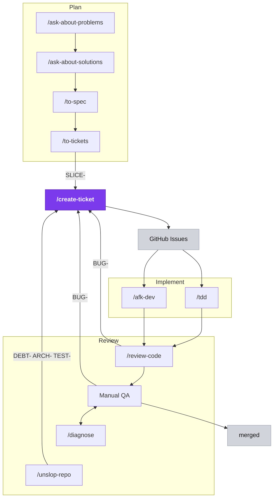

# {{PROJECT_NAME}} — Documentation

This folder keeps product intent and dev agents aligned. **Read before expanding scope.**
The layout below is **closed** — see the rule at the bottom.

## The flow — Plan, Implement, Review

Three stages around `/create-ticket` — the **only** skill that runs `gh issue create`, the
hub every ticket flows through. **Plan** files new work as `SLICE-`; **Review** files
`DEBT-`/`ARCH-`/`TEST-` (from `/unslop-repo`) and `BUG-` (from `/review-code` and Manual
QA). Manual QA ⇄ `/diagnose` is the iterative debug loop; passing QA ships to `merged`.

**Two entry points**, decided by one question — *was this capability ever built?* The
*feature lane* (never built) plans through interview → spec → tickets; the *maintenance
lane* (shipped behavior) files straight to `/create-ticket`, since history already made the
decisions ("it used to do X, now does Y" *is* the spec).

## Workflow (in order)

| Step | Skill | Output |
|------|-------|--------|
| 0 | `/init-docs` | This layout (once per repo) |
| 1 | `/ask-about-problems` | [`foundation/OVERVIEW.md`](foundation/OVERVIEW.md) → Problem section |
| 2 | `/ask-about-solutions` | OVERVIEW.md solution sections + [`foundation/DICTIONARY.md`](foundation/DICTIONARY.md) (+ sparing ADRs) |
| 3 | `/to-spec` | **Spec issue on GitHub** (label `spec`) — agent-facing, not reviewed |
| 4 | `/to-tickets` | SLICE tickets, blocked-by wired, children of the spec |
| 5 | `/tdd` or `/afk-dev` | Implementation with tests → PR(s) |
| 6 | `/review-code` | Two-axis review per PR (standards + spec fidelity) |
| 7 | you | Manual QA → merge |
| — | `/diagnose` → `/create-ticket` | Maintenance lane: bugs, regressions |
| — | `/unslop-repo` → `/create-ticket` | Architecture hygiene (periodic) |

## Which lane? (routing rule)

| Situation | Route |
|---|---|
| Manual QA finds shipped behavior broken/regressed | `/create-ticket` (BUG) — directly |
| Manual QA reveals a capability that was never built | Feature lane — usually `/ask-about-solutions` first |
| `/diagnose` root-caused a bug worth tracking | `/create-ticket` (BUG) |
| `/unslop-repo` deepening approved | `/create-ticket` (DEBT/ARCH/TEST/SPIKE) |
| New feature / scope | Full feature lane |

## Where things go

| Content | Path |
|---------|------|
| Problem, system idea, components, workflows, decisions (human-readable) | `foundation/OVERVIEW.md` |
| Canonical domain vocabulary | `foundation/DICTIONARY.md` |
| Committed scope + user stories + seams (agent-facing) | **Spec issue on GitHub**, label `spec` — never a repo doc |
| Hard-to-reverse technical decisions (agent memory) | `reviews/adr/NNN-slug.md` (created lazily) |
| Shipped-architecture skip-list (optional) | `reviews/README.md` |
| One-off analysis / review write-ups | `reviews/<date>-<topic>.md` |
| `/afk-dev` cycle plans, logs, summaries | `engineering/loops/` |
| Module deep dives | `engineering/modules/<name>.md` |
| Security-relevant docs | `engineering/security/` |
| Build, dev, tooling docs | `engineering/ops/` |
| Repo-specific notes for AI agents (tracker, launch, board) | `AGENTS.md` (repo root) |
| Findings / backlog items | a GitHub issue via `/create-ticket` — never a new doc |

## File roles

- **`foundation/OVERVIEW.md`** — THE human-readable doc: problem → system idea & key
  components → key user workflows → decisions → out of scope. 5-minute read, always current.
- **`foundation/DICTIONARY.md`** — canonical terms; OVERVIEW component names and all
  tickets use these exactly.
- **`reviews/adr/`** — one-paragraph decision records (`NNN-slug.md`, created lazily),
  written by agents when a decision is hard-to-reverse + surprising + a real trade-off.
  Agents read them to avoid re-litigating; humans get the one-line version in OVERVIEW.md
  Decisions.
- **`AGENTS.md`** (repo root) — repo-specific notes for AI agents: tracker, launch/env,
  project board, skill quick-reference.
- **`engineering/loops/`** — `/afk-dev` cycle artifacts. Worker sandboxes: `.worktrees/` (gitignored).

## During development

- **Scope drift:** if the change isn't traceable to a spec issue or OVERVIEW.md, stop —
  route through the correct lane first.
- **Bugs:** `/diagnose` — failing test at the correct UI seam, not session log files.
- **Manual QA:** checklists live at `docs/engineering/ops/manual-qa-*.md`; findings route
  per the table above.

## Closed-layout rule

This layout is **closed**: every doc lives at one of the paths above. Never create a new
top-level doc folder, a loose file at `docs/` root, or a `-vN` filename variant. Specs
are GitHub issues, findings and backlog items are GitHub issues via `/create-ticket` —
never new docs. If nothing fits, ask — do not invent a path.

## Naming rule

All filenames are **kebab-case**, except `README.md`, `OVERVIEW.md`, `DICTIONARY.md`, and
the root `AGENTS.md`, which keep their conventional all-caps names.
